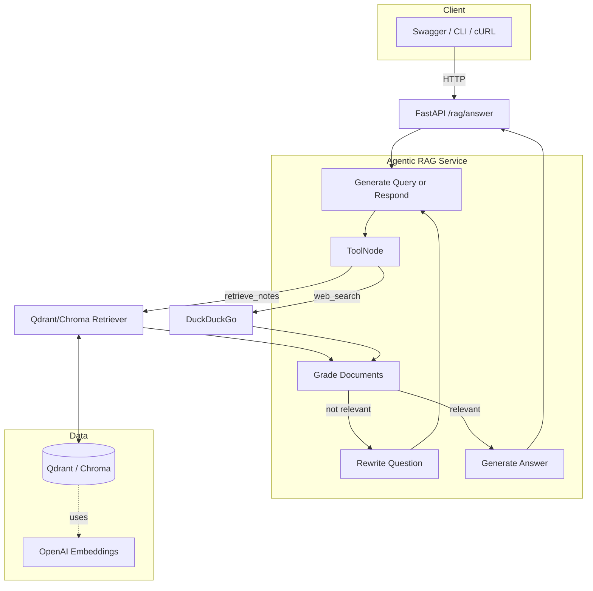

<div align="center">

# Alfred — Agentic RAG API


An elegant FastAPI service that answers questions using Agentic RAG. It chooses between your personal notes (Qdrant/Chroma) and live web research (DuckDuckGo), then writes in your voice with minimal, professional style.

</div>

## System Design



Highlights
- Agentic retrieval with LangGraph: decide to retrieve, search, or answer directly.
- Qdrant (cloud) preferred; Chroma fallback for local dev.
- Flexible answer styles via `mode`: minimal, concise, formal, deep.
- Clean, grounded voice; inline attributions and tiny Sources section.

## Quick Start

Prereqs
- Docker + Docker Compose
- Python 3.11+
- uv (https://github.com/astral-sh/uv) — optional but recommended
- API keys: OpenAI (for embeddings/LLM); optional Qdrant Cloud

Configure
```bash
cp apps/alfred/.env.example apps/alfred/.env
# Fill in: OPENAI_API_KEY, (optional) QDRANT_URL/QDRANT_API_KEY, NOTION_TOKEN, etc.
```

Install & Run API
```bash
uv python install 3.11          # optional: ensure matching runtime
uv sync --dev                    # install app + tooling into .venv
uv run playwright install chromium  # optional: enable dynamic crawling
make run-api  # or: PYTHONPATH=apps uv run uvicorn alfred.main:app --reload --port 8000
```

Legacy virtualenv (pip)
```bash
python3.11 -m venv venv
source venv/bin/activate
pip install -r requirements.txt -r requirements-dev.txt
python -m playwright install chromium  # optional: enable dynamic crawling
make run-api UV=0  # or: PYTHONPATH=apps uvicorn alfred.main:app --reload --port 8000
```

Docker (full stack)
```bash
docker compose -f infra/docker-compose.yml up --build
```

## Database & Migrations

- Configure `DATABASE_URL` in `apps/alfred/.env` (defaults to a local SQLite file).
- Run migrations locally: `uv run alembic -c alembic.ini upgrade head`.
- Create a new migration: `uv run alembic -c alembic.ini revision --autogenerate -m "<description>"`.
- If you point `DATABASE_URL` at Postgres, install a driver such as `psycopg[binary]` in your environment.
- Base models live in `apps/alfred/models/`; extend `Model` for timestamped tables with an auto primary key, and declare columns directly with SQLAlchemy's `mapped_column` helpers.
- Mongo access lives in `apps/alfred/services/mongo.py`; configure `MONGO_URI`, `MONGO_DATABASE`, and `MONGO_APP_NAME` (defaults connect to `mongodb://localhost:27017/alfred`).
- Company research runs persist their structured reports into Mongo (collection defaults to `company_research_reports`). Use `/company/research?refresh=true` to force a fresh crawl + regeneration.

## Ingest Knowledge

Use built-in web and PDF ingestion to populate your vector store.

```bash
# Optionally set recursion depth for link-following (0 = off)
export RECURSIVE_DEPTH=1

# Qdrant Cloud
export QDRANT_URL=...; export QDRANT_API_KEY=...; export QDRANT_COLLECTION=personal_kb

# Run ingest
uv run python scripts/ingest.py --urls-file urls.txt --collection personal_kb
# Or direct URLs
uv run python scripts/ingest.py --url https://example.com --url https://arxiv.org/abs/2012.07587
```
If you're working from an existing virtualenv, swap `uv run python` for `python` and append `UV=0` to Make targets (e.g. `make ingest-urls UV=0`).


Notes
- WebBaseLoader + optional RecursiveUrlLoader gather pages; PDFs from `data/` via PyPDFLoader.
- Chunking defaults: size 12000, overlap 200; deterministic IDs avoid duplicates.
- Embeddings: `EMBED_MODEL` (default `text-embedding-3-small`).

## RAG API

Endpoint
- `GET /rag/answer`

Query params
- `q` string: question
- `k` int: top-k retrieval (default 4)
- `include_context` bool: include retrieved chunks metadata
- `mode` string: `minimal` | `concise` | `formal` | `deep`

Example
```bash
curl "http://localhost:8000/rag/answer?q=Research%20Harmonic%20and%20write%20a%20cover%20letter&k=8&mode=deep&include_context=true"
```

Behavior
- Agent decides to use `retrieve_notes` (Qdrant/Chroma) and/or `web_search` (DuckDuckGo).
- Answers in your voice, grounded strictly in context; admits when unknown.

### `GET /company/research`

Query params
- `name` string: company to investigate.
- `refresh` bool (optional, default `false`): force a new SearxNG search + Firecrawl crawl instead of returning the cached Mongo record.

Response shape
- `company`, `model`, `generated_at`
- `report`: structured object with `executive_summary`, dynamic `sections[]`, `risks`, `opportunities`, `recommended_actions`, `references`
- `sources`: enriched search hits with snippets + scraped markdown
- `search`: metadata describing the provider + hit count

The service crawls top SearxNG results with Firecrawl, feeds the markdown to GPT-5.1, then persists the structured JSON to Mongo (`COMPANY_RESEARCH_COLLECTION`).

### `GET /company/outreach`

Query params
- `name` string: target company name.
- `role` string (optional, default `AI Engineer`): angle to tailor the outreach.

Response
- Structured JSON including `summary`, `positioning`, `suggested_topics`, `outreach_email`, `follow_up`, and `sources` combining resume/profile knowledge with live company research.

### `POST /company/outreach`

Body
```json
{
  "name": "Anthropic",
  "role": "Senior AI Engineer",
  "context": "Focus on my applied research background and experience building RAG pipelines.",
  "k": 8
}
```

Behavior
- Same personalized outreach agent with optional extra instructions (`context`) and retrieval depth override `k`.
- Outputs JSON identical to the GET variant.

> Tip: run `uv run python scripts/ingest.py` (or `python scripts/ingest.py` with `UV=0`) so your resume and personal URLs are embedded before calling the outreach endpoints.

### `POST /research/deep`

Body
```json
{
  "query": "How are frontier model labs addressing alignment?",
  "target_length_words": 1000,
  "tone": "technical"
}
```

Returns
- `article`: polished ~1k-word markdown article synthesized from multi-provider web search and internal notes.
- `state`: LangGraph state snapshot (expanded queries, evidence notes, outline, draft, etc.) for debugging or audits.
- Successful runs are archived in Postgres (`research_runs`) so you can review historical articles or build dashboards.

## Makefile

Useful targets
- `make install` — app + dev deps
- `make run-api` — run FastAPI locally
- `make run-worker` — Celery worker (if used)
- `make docker-up` / `make docker-down`
- `make lint` / `make format`
- `make ingest-urls FILE=urls.txt [COLLECTION=personal_kb]`

## Configuration

Core env vars
- `OPENAI_API_KEY` — required
- `QDRANT_URL`, `QDRANT_API_KEY`, `QDRANT_COLLECTION` — for Qdrant backend
- `CHROMA_PATH` — local fallback store (default `./chroma_store`)
- `EMBED_MODEL`, `CHAT_MODEL`, `FALLBACK_MODEL`
- `RECURSIVE_DEPTH` — optional crawl depth for ingest (default 0)

Web search providers (optional)
- `SEARXNG_HOST` (or `SEARX_HOST`) — SearxNG base URL (e.g. `http://127.0.0.1:8080`). When set, provider `searx` is available in `/api/web/search`.
- `LANGSEARCH_API_KEY` — enables the `langsearch` provider in `/api/web/search`. Optionally override endpoint via `LANGSEARCH_API_URL` (defaults to `https://api.langsearch.com/v1`).

Company research pipeline
- `FIRECRAWL_BASE_URL` / `FIRECRAWL_TIMEOUT` — Firecrawl instance used to pull markdown from each URL.
- `COMPANY_RESEARCH_MODEL` — OpenAI chat model for synthesis (default `gpt-5.1`).
- `COMPANY_RESEARCH_COLLECTION` — Mongo collection for persisted reports (default `company_research_reports`).

Observability (Langfuse)
- `LANGFUSE_PUBLIC_KEY`, `LANGFUSE_SECRET_KEY` — project keys from your Langfuse instance.
- `LANGFUSE_HOST` — base URL for your self-hosted Langfuse (e.g. `http://localhost:3000`).
- `LANGFUSE_DEBUG` — `true/false` to enable SDK debug logs (default `false`).
- `LANGFUSE_TRACING_ENABLED` — `true/false` master switch (default `true`).

Notes
- Tracing is optional. If keys are not set or the SDK is not installed, the decorators become no-ops and the app runs normally.
- To install SDK: `pip install langfuse` (or add to your environment).
- Example traced endpoints/functions: `/api/web/search` route and the `alfred.services.web_search.search_web` tool.

## Tech Stack Badges


## Notes & Tips
- Robots-aware crawling; polite rate limiting. LinkedIn and auth-gated sites are skipped.
- `PYTHONDONTWRITEBYTECODE=1` is set in Makefile and Docker to avoid `__pycache__` noise.
- Keep secrets out of Git; use `apps/alfred/.env`.

---

Made with FastAPI + LangChain + LangGraph. PRs welcome.
